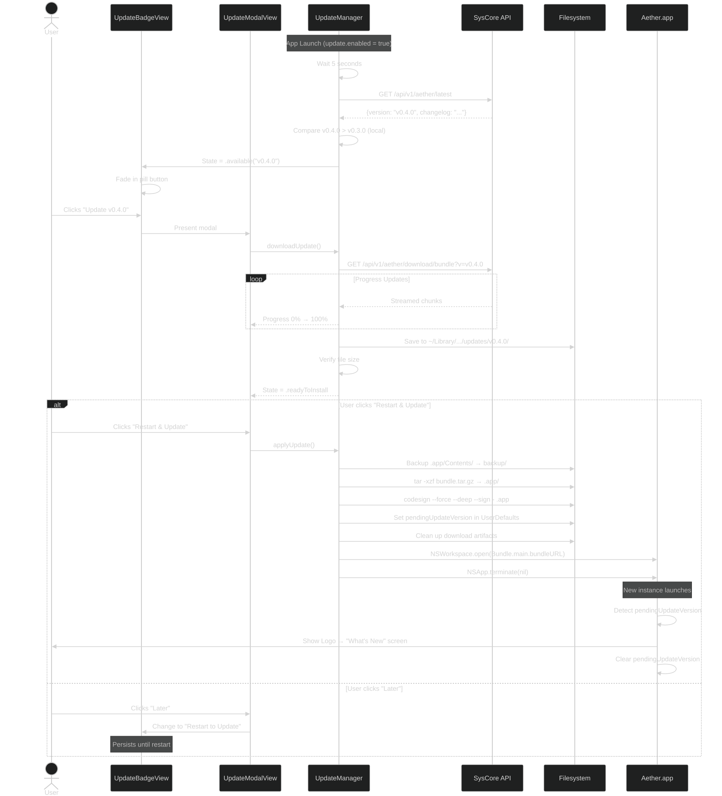
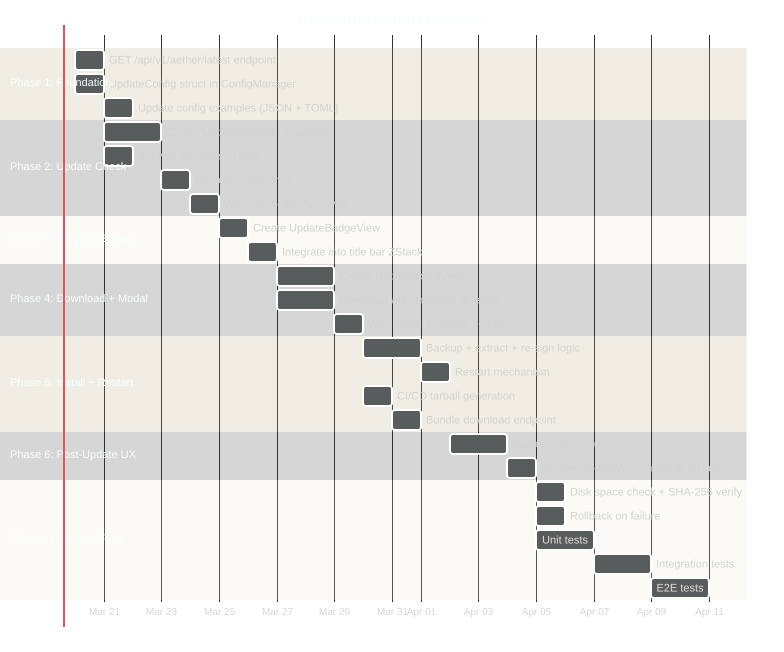

# Aether Auto-Update System — Architecture Plan

> **Status**: Proposed  
> **Author**: Vaiditya Tanwar   
> **Date**: 2026-03-19  
> **Scope**: In-application auto-update for Aether terminal emulator without reinstallation  

---

## Table of Contents

1. [Executive Summary](#1-executive-summary)
2. [Why This Works Without Gatekeeper](#2-why-this-works-without-gatekeeper-re-approval)
3. [System Architecture](#3-system-architecture)
4. [Backend Changes (SysCore)](#4-backend-changes-syscore)
5. [Configuration](#5-configuration)
6. [Client-Side Architecture (Swift)](#6-client-side-architecture-swift)
7. [Update State Machine](#7-update-state-machine)
8. [Complete Update Flow](#8-complete-update-flow)
9. [Install Sequence](#9-install-sequence-diagram)
10. [UI Components](#10-ui-components)
11. [File System Layout](#11-file-system-layout)
12. [Security Considerations](#12-security-considerations)
13. [State Persistence Across Restart](#13-state-persistence-across-restart)
14. [Implementation Phases](#14-implementation-phases)
15. [Test Plan](#15-test-plan)
16. [Risks and Mitigations](#16-risks-and-mitigations)
17. [File Change Summary](#17-file-change-summary)

---

## 1. Executive Summary

The system enables Aether to check for updates, download new versions, and apply them **without reinstalling** — avoiding macOS Gatekeeper re-approval. The update replaces the internals of the existing `.app` bundle in-place, requiring only an app restart. Users have full control via a config toggle in `~/.config/aether/config.json` or `config.toml`.

**Key principles:**

- Zero friction — one-click update from inside the app
- No Gatekeeper — in-place bundle patching, not a new install
- User control — config toggle to enable/disable entirely
- Resilient — backup before install, rollback on failure
- Theme-aware — all UI matches the user's chosen theme

---

## 2. Why This Works Without Gatekeeper Re-Approval

macOS Gatekeeper quarantine is applied to the **outer `.app` bundle** when first downloaded/opened. Once the user approves it, the `com.apple.quarantine` extended attribute is cleared. Replacing files *inside* the bundle (executables, frameworks, resources) does **not** re-trigger Gatekeeper — the approval lives on the `.app` directory itself.

**Critical constraint:** The bundle must be re-signed ad-hoc after patching. The `codesign` CLI is available on all macOS systems. This is the same technique used by Sparkle, VS Code, and iTerm2.

```
Gatekeeper checks:
  ✅ First install from DMG     → User approves once
  ✅ In-place binary replace     → No re-approval needed
  ✅ Ad-hoc re-sign after patch  → codesign --force --deep --sign -
  ❌ New .app from new DMG       → Gatekeeper triggers again (we avoid this)
```

---

## 3. System Architecture

The auto-update system spans three domains: the **SysCore backend** (artifact storage + API), the **Aether client** (check/download/install), and **GitHub Actions CI/CD** (build + publish).



### Component Responsibilities

| Component | Role |
|-----------|------|
| **SysCore API** | Serves version metadata and bundle tarballs |
| **UpdateManager** | Client-side singleton owning the full update lifecycle |
| **UpdateBadgeView** | Title bar indicator when update is available |
| **UpdateModalView** | Download/install progress overlay |
| **UpdateLetterView** | Post-update "What's New" screen |
| **ConfigManager** | Reads `update.enabled` and related settings |
| **GitHub Actions** | Builds `.tar.gz` bundles and publishes to SysCore |

---

## 4. Backend Changes (SysCore)

### 4.1 New Endpoint: `GET /api/v1/aether/latest`

Lightweight version-check endpoint. The existing `GET /api/v1/aether` returns ALL versions — too heavy for periodic polling.

**File:** `syscore/src/server/aether.rs`

**Response:**
```json
{
  "version": "v0.4.0",
  "description": "Performance improvements and bug fixes",
  "changelog": "- Fixed rendering on M3 chips\n- 2x faster startup\n- New Rosé Pine theme",
  "release_date": "2026-03-19T00:00:00Z",
  "size": 28456000
}
```

**Implementation:** Reuses `list_handlers` logic but returns only the first (latest by `release_date`) entry. Returns `404` if no versions exist.

**Route registration** in `lib.rs`:
```rust
.route("/api/v1/aether/latest", get(latest_handler))
```

### 4.2 New Endpoint: `GET /api/v1/aether/download/bundle`

Serves a `.tar.gz` of the **app bundle contents** (not a DMG). A tarball can be extracted in-place — a DMG requires mounting and manual drag-to-Applications.

**How it works:**
- CI/CD builds Aether, creates both the DMG (for fresh installs) and a `Aether-bundle-{version}.tar.gz` (for updates)
- The tarball contains the `Contents/` directory from inside `Aether.app/`
- Stored alongside the DMG in `storage/aether/{version}/`

**Query params:** `?v=VERSION` or `?v=latest`

**Response:** Streamed `application/gzip` binary

### 4.3 Upload Handler Update

Modify `upload_handler` to accept an optional second file field `bundle` (the `.tar.gz`). The `metadata.json` gains new fields:

```json
{
  "version": "v0.4.0",
  "description": "...",
  "changelog": "...",
  "release_date": "2026-03-19T00:00:00Z",
  "filename": "Aether_Installer.dmg",
  "size": 28456000,
  "bundle_filename": "Aether-bundle-v0.4.0.tar.gz",
  "bundle_size": 24000000
}
```

### 4.4 CI/CD Change

**File:** `.github/workflows/aether-release.yml`

After building the `.app` bundle, add:
```bash
cd build_artifact
tar -czf "Aether-bundle-${VERSION}.tar.gz" -C Aether.app Contents
```

Upload both DMG and tarball in the multipart POST to SysCore.

---

## 5. Configuration

### 5.1 Config Schema Addition

Add an `update` section to `AetherConfig`. Both JSON and TOML formats are supported.

**JSON** (`~/.config/aether/config.json`):
```json
{
  "update": {
    "enabled": true,
    "check_interval": 3600,
    "server_url": "https://api.hackmist.tech",
    "channel": "stable"
  }
}
```

**TOML** (`~/.config/aether/config.toml`):
```toml
[update]
enabled = true
check_interval = 3600
server_url = "https://api.hackmist.tech"
channel = "stable"
```

### 5.2 Config Fields

| Field | Type | Default | Description |
|-------|------|---------|-------------|
| `enabled` | bool | `true` | Master toggle. `false` = no network calls, no UI indicator, complete opt-out |
| `check_interval` | int | `3600` | Seconds between version checks (minimum enforced: 300) |
| `server_url` | string | `"https://api.hackmist.tech"` | SysCore server base URL |
| `channel` | string | `"stable"` | Future-proofing for beta/nightly channels |

### 5.3 Swift Config Struct

**File:** `ConfigManager.swift`

```swift
struct UpdateConfig: Codable {
    var enabled: Bool = true
    var checkInterval: Int = 3600
    var serverUrl: String = "https://api.hackmist.tech"
    var channel: String = "stable"

    enum CodingKeys: String, CodingKey {
        case enabled
        case checkInterval = "check_interval"
        case serverUrl = "server_url"
        case channel
    }
}
```

Add `var update: UpdateConfig = UpdateConfig()` to `AetherConfig`.

---

## 6. Client-Side Architecture (Swift)

### 6.1 UpdateManager

**File:** `AetherApp/Sources/AetherApp/Models/UpdateManager.swift`

Singleton `ObservableObject` that owns the entire update lifecycle.

```swift
class UpdateManager: ObservableObject {
    static let shared = UpdateManager()

    @Published var state: UpdateState = .idle
    @Published var availableVersion: AetherVersionInfo?
    @Published var downloadProgress: Double = 0.0
    @Published var statusMessage: String = ""

    enum UpdateState {
        case idle              // No update available or disabled
        case checking          // Calling /latest
        case available(String) // New version found
        case downloading       // Download in progress
        case readyToInstall    // Download complete
        case installing        // Replacing bundle contents
        case failed(String)    // Error occurred
        case restartRequired   // Install done, needs restart
    }

    func checkForUpdates() { }
    func downloadUpdate() { }
    func applyUpdate() { }
    func restartApp() { }
    func schedulePeriodicCheck() { }
    func cancelDownload() { }
}
```

### 6.2 Version Comparison

Use semantic versioning comparison (major.minor.patch numerically). **Never string comparison.**

```swift
struct SemanticVersion: Comparable {
    let major: Int, minor: Int, patch: Int

    init?(_ string: String) {
        let cleaned = string.hasPrefix("v") ? String(string.dropFirst()) : string
        let parts = cleaned.split(separator: ".").compactMap { Int($0) }
        guard parts.count == 3 else { return nil }
        (major, minor, patch) = (parts[0], parts[1], parts[2])
    }

    static func < (lhs: Self, rhs: Self) -> Bool {
        (lhs.major, lhs.minor, lhs.patch) < (rhs.major, rhs.minor, rhs.patch)
    }
}
```

### 6.3 Network Resilience

- **Timeout:** 10 seconds for version check, 120 seconds for download
- **Background check failure:** Silently retry at next interval (no error UI)
- **Manual check failure:** Show error in modal
- **Download failure:** Show error in modal with retry button

---

## 7. Update State Machine

The `UpdateManager` follows a strict state machine. Every UI element is driven by this state.



### State Transitions

| From | Event | To |
|------|-------|----|
| `idle` | Timer fires / manual check | `checking` |
| `checking` | Remote > Local | `available` |
| `checking` | Remote <= Local / error | `idle` |
| `available` | User clicks badge | `downloading` |
| `downloading` | 100% complete | `readyToInstall` |
| `downloading` | Error | `failed` |
| `downloading` | User cancels | `idle` |
| `readyToInstall` | "Restart & Update" | `installing` |
| `readyToInstall` | "Later" | `restartPending` |
| `installing` | Success | `restartRequired` |
| `installing` | Error | `failed` |
| `failed` | Retry | `checking` |
| `failed` | Dismiss | `idle` |
| `restartRequired` | — | App restarts → post-update flow |

---

## 8. Complete Update Flow

End-to-end flow from app launch to post-update experience:



---

## 9. Install Sequence Diagram

Detailed interaction between all components during the update process:



### Install Steps (Critical Path)

```
1. Verify download integrity (file size matches metadata.size)
2. Locate current app bundle: Bundle.main.bundlePath
3. Backup: Copy current Contents/ → ~/Library/Application Support/Aether/backup/
4. Extract: tar -xzf {download} -C {bundle_path}/
5. Re-sign: codesign --force --deep --sign - {bundle_path}
6. Set pendingUpdateVersion in UserDefaults
7. Clean up download artifacts
8. Restart: NSWorkspace.open(bundleURL) + NSApp.terminate()
```

**Why `tar` via Process?** Swift's built-in archive support is limited. `/usr/bin/tar` is available on every macOS, is fast, and handles `.tar.gz` natively. Run via `Process()`.

**Why ad-hoc re-sign?** Replacing the executable invalidates the existing code signature. Ad-hoc signing creates a new local signature without needing a Developer ID certificate. This is what the current `build_release.sh` already does.

**Rollback:** If step 4 or 5 fails, restore from backup immediately. Show clear error to user.

---

## 10. UI Components

### 10.1 Title Bar Layout

The update badge sits in the right side of the existing 28pt custom title bar:



**Badge spec:**

| Property | Value |
|----------|-------|
| Shape | Capsule (fully rounded pill) |
| Font | System 10pt, medium weight, monospaced |
| Padding | Horizontal 8pt, vertical 3pt |
| Background | Theme's `selection` color at 60% opacity |
| Text color | Theme's `foreground` color |
| Hover | Background opacity → 90% |
| Animation | 0.3s fade-in when update available |
| Content | `"Update v{X.Y.Z}"` + `arrow.down.circle` SF Symbol |
| Visibility | Hidden when `update.enabled = false` OR no update available |

**SwiftUI component:** `UpdateBadgeView`

```swift
struct UpdateBadgeView: View {
    @ObservedObject var updateManager: UpdateManager
    let theme: ColorConfig

    var body: some View {
        // Capsule pill button, theme-aware colors
        // Triggers modal on tap
    }
}
```

**Integration point** in `AetherApp.swift` (lines 48-51, existing empty HStack):

```swift
HStack {
    Spacer()
    if configManager.config.update.enabled {
        UpdateBadgeView(
            updateManager: updateManager,
            theme: configManager.config.colors
        )
        .padding(.trailing, 8)
    }
}
.frame(height: 28)
```

### 10.2 Update Modal

The modal is a centered overlay with glass morphism styling matching the app aesthetic.



**Modal spec:**

| Property | Value |
|----------|-------|
| Background | `VisualEffectView(material: .hudWindow)` + dark overlay |
| Corner radius | 12pt |
| Width | 320pt fixed |
| Height | Intrinsic (content-driven) |
| Buttons | Capsule shape, theme-aware colors |
| Progress bar | Capsule, theme accent fill, secondary track |
| Animation | Spring entrance from bottom, opacity exit |
| Dismiss | Click outside (except during `.installing`) |

**State-driven content:**

| State | Content |
|-------|---------|
| `.checking` | Spinner + "Checking for updates..." |
| `.downloading` | Progress bar + file size + Cancel button |
| `.readyToInstall` | "Ready!" + "Restart Now" (primary) + "Later" (secondary) |
| `.installing` | Spinner + "Applying update..." + "Do not quit Aether" |
| `.failed` | Error message + Retry + Dismiss |

### 10.3 Post-Update "What's New" View

Shown after app restarts from an update. Reuses `StartupView`'s visual language.

**Sequence:**
1. **Stage 1:** OKernel logo (2.5s, same as first-run)
2. **Stage 2:** "What's New in Aether {version}" — changelog rendered with same glass styling as the CEO letter
3. **[CONTINUE]** button → normal terminal launch

**Trigger:** Check `pendingUpdateVersion` in UserDefaults on launch. If present, show this flow instead of normal launch. Clear the flag after display.

---

## 11. File System Layout



### Directory Purposes

```
~/Library/Application Support/Aether/
├── sessions.plist                         # Existing session persistence
├── updates/                               # Downloaded update bundles
│   └── v0.4.0/
│       └── Aether-bundle-v0.4.0.tar.gz
└── backup/                                # Pre-update backup (single version)
    └── Contents/                          # Copy of bundle before patching

~/.config/aether/
├── config.json                            # User config (gains "update" section)
└── config.toml                            # Alternative TOML config

/Applications/Aether.app/                  # The app bundle (patched in-place)
└── Contents/
    ├── MacOS/AetherApp                    # Replaced on update
    ├── Frameworks/                        # Replaced on update
    ├── Resources/                         # Replaced on update
    └── Info.plist                         # Updated with new version
```

---

## 12. Security Considerations

| Concern | Mitigation |
|---------|-----------|
| **Man-in-the-middle** | Server uses HTTPS (`api.hackmist.tech`). ATS enforced by default on macOS. |
| **Tampered binary** | Verify downloaded file size against `metadata.size`. **Phase 2:** Add SHA-256 checksum to metadata and verify before install. |
| **Privilege escalation** | No `sudo` or admin required. App writes only to its own bundle + user-writable directories. |
| **Rollback/downgrade attack** | Only update if remote > local (semver). Never downgrade. |
| **Interrupted install** | Backup exists. If extraction or signing fails, restore backup before presenting error. |
| **Disk space** | Check available disk before download (need ~2x update size). Clean up after install. |
| **Read-only bundle path** | Detect before attempting. Show clear error: "Move Aether to a writable location." |
| **App running from DMG** | Detect read-only filesystem. Show: "Please install Aether first." |

---

## 13. State Persistence Across Restart

| Key (UserDefaults) | Type | Purpose |
|---------------------|------|---------|
| `pendingUpdateVersion` | `String?` | Set before restart, cleared after "What's New" |
| `pendingUpdateChangelog` | `String?` | Changelog text for the "What's New" view |
| `lastUpdateCheck` | `Date?` | Timestamp of last successful version check |
| `updateDownloadedVersion` | `String?` | Version of completed download awaiting install |

---

## 14. Implementation Phases



### Phase 1: Foundation (Backend + Config)

1. Add `GET /api/v1/aether/latest` endpoint to `syscore/src/server/aether.rs`
2. Add `UpdateConfig` struct to `ConfigManager.swift`
3. Update `config.example.json` and `config.example.toml` with `update` section
4. Update config decoder to handle new section with defaults

### Phase 2: Update Check

5. Create `UpdateManager.swift` — singleton, `ObservableObject`
6. Implement `checkForUpdates()` with URLSession GET to `/api/v1/aether/latest`
7. Implement semver comparison logic
8. Implement `schedulePeriodicCheck()` with Timer
9. Wire into `AetherApp.swift` — initialize on launch if `update.enabled`

### Phase 3: Title Bar Badge

10. Create `UpdateBadgeView.swift` — theme-aware capsule button
11. Integrate into `AetherApp.swift` title bar ZStack (right-aligned, existing HStack at line 48)
12. Bind visibility and content to `UpdateManager.state`

### Phase 4: Download + Modal

13. Create `UpdateModalView.swift` — state-driven overlay
14. Implement `downloadUpdate()` with `URLSessionDownloadTask` + progress delegate
15. Implement `cancelDownload()`
16. Wire modal presentation to badge tap and UpdateManager state changes

### Phase 5: Install + Restart

17. Implement `applyUpdate()` — backup → extract → re-sign → cleanup
18. Implement `restartApp()` — `NSWorkspace.open()` new instance, `NSApp.terminate()` current
19. Add bundle tarball generation to CI/CD (`aether-release.yml`)
20. Add `GET /api/v1/aether/download/bundle` endpoint (or reuse existing with `?format=bundle`)

### Phase 6: Post-Update Experience

21. Create `UpdateLetterView.swift` (or extend `StartupView` with `.updateLetter` stage)
22. Check `pendingUpdateVersion` on app launch
23. Show logo → changelog sequence, then continue to terminal

### Phase 7: Polish + Tests

24. Add disk space check before download
25. Add backup restoration on install failure
26. Add SHA-256 checksum verification (`checksum` field in `AetherVersion`)
27. Clean up old downloads/backups automatically
28. Write all unit, integration, and E2E tests

---

## 15. Test Plan

### 15.1 Unit Tests

**File:** `AetherApp/Tests/AetherAppTests/UpdateManagerTests.swift`

| ID | Test | Verifies |
|----|------|----------|
| U1 | `test_semver_comparison_major` | `v1.0.0 > v0.9.9` → true |
| U2 | `test_semver_comparison_minor` | `v0.4.0 > v0.3.0` → true |
| U3 | `test_semver_comparison_patch` | `v0.3.1 > v0.3.0` → true |
| U4 | `test_semver_comparison_equal` | `v0.3.0 == v0.3.0` → no update |
| U5 | `test_semver_comparison_older` | `v0.2.0 < v0.3.0` → no downgrade |
| U6 | `test_semver_parsing_with_v_prefix` | Handles both `"v0.3.0"` and `"0.3.0"` |
| U7 | `test_config_default_update_enabled` | Default `UpdateConfig` has `enabled = true` |
| U8 | `test_config_disabled_prevents_check` | `enabled = false` → `checkForUpdates()` is no-op, state stays `.idle` |
| U9 | `test_config_minimum_interval_enforced` | `check_interval < 300` clamped to `300` |
| U10 | `test_config_json_decode_missing_update` | Config without `"update"` key uses defaults |
| U11 | `test_config_toml_decode_update_section` | TOML `[update]` section parses correctly |
| U12 | `test_update_state_transitions` | Full state machine: `idle → checking → available → downloading → readyToInstall → installing → restartRequired` |
| U13 | `test_download_progress_calculation` | Known total/received bytes → correct progress % |
| U14 | `test_backup_path_construction` | Backup dir = `~/Library/Application Support/Aether/backup/` |
| U15 | `test_download_path_construction` | Download goes to correct versioned subdirectory |

**File:** `syscore/tests/api_tests.rs`

| ID | Test | Verifies |
|----|------|----------|
| U16 | `test_latest_endpoint_returns_newest` | `/api/v1/aether/latest` returns most recent by `release_date` |
| U17 | `test_latest_endpoint_empty_storage` | Returns 404 when no versions exist |
| U18 | `test_latest_endpoint_response_shape` | Response has all required fields |
| U19 | `test_bundle_download_serves_tarball` | `/api/v1/aether/download/bundle` returns `application/gzip` |
| U20 | `test_bundle_download_latest_resolves` | `?v=latest` resolves to newest version |

### 15.2 Integration Tests

**File:** `AetherApp/Tests/AetherAppTests/UpdateIntegrationTests.swift`

| ID | Test | Verifies |
|----|------|----------|
| I1 | `test_version_check_against_mock_server` | Mock HTTP server returns `/latest` JSON → `UpdateManager` transitions to `.available` when remote > local |
| I2 | `test_version_check_no_update` | Mock returns same version → state stays `.idle` |
| I3 | `test_version_check_server_unreachable` | No server → state stays `.idle`, no crash, retries next interval |
| I4 | `test_version_check_malformed_response` | Invalid JSON → graceful handling, state stays `.idle` |
| I5 | `test_download_to_disk` | Mock serves small `.tar.gz` → file lands at correct path with correct size |
| I6 | `test_download_cancellation` | Start download → `cancelDownload()` → partial file cleaned up |
| I7 | `test_download_progress_reporting` | Known-size mock response → progress callbacks fire 0.0 → 1.0 |
| I8 | `test_config_toggle_runtime` | `enabled: true → false` at runtime → timer invalidated, badge hidden |
| I9 | `test_pending_update_persisted` | Set `pendingUpdateVersion` in UserDefaults → new UpdateManager reads pending state |
| I10 | `test_backup_and_restore` | Mock bundle → backup → corrupt → restore → original contents intact |

### 15.3 End-to-End Update Tests

**File:** `AetherApp/Tests/AetherAppTests/UpdateE2ETests.swift`

**Prerequisites:**
- Local SysCore running on `127.0.0.1:3001`
- Test fixture: two `.tar.gz` bundles (v0.3.0 and v0.4.0) containing minimal valid `.app` Contents

---

#### Test: `test_full_update_lifecycle`

```
STEP 1: SETUP
  - Start local SysCore
  - Upload v0.3.0 bundle via POST /api/v1/aether
  - Upload v0.4.0 bundle via POST /api/v1/aether
  - Create temp .app bundle simulating v0.3.0
    (Info.plist with CFBundleShortVersionString = "0.3.0")
  - Point UpdateManager at temp bundle path

STEP 2: VERSION CHECK
  - Call updateManager.checkForUpdates()
  - Assert: state == .available("v0.4.0")
  - Assert: availableVersion.changelog is non-empty

STEP 3: DOWNLOAD
  - Call updateManager.downloadUpdate()
  - Wait for state == .readyToInstall
  - Assert: file exists at download path
  - Assert: file size matches metadata.size

STEP 4: INSTALL
  - Call updateManager.applyUpdate()
  - Wait for state == .restartRequired
  - Assert: temp bundle's Info.plist now says 0.4.0
  - Assert: backup directory contains old v0.3.0 Contents
  - Assert: pendingUpdateVersion == "v0.4.0"

STEP 5: VERIFY POST-UPDATE STATE
  - Read pendingUpdateVersion from UserDefaults
  - Assert: "What's New" flow would trigger
  - Clear the flag
  - Assert: pendingUpdateVersion is nil

STEP 6: CLEANUP
  - Delete temp directories
  - Delete test versions from SysCore storage
```

---

#### Test: `test_update_with_disabled_config`

```
STEP 1: Set update.enabled = false
STEP 2: Call checkForUpdates()
STEP 3: Assert: zero network requests (mock URLProtocol)
STEP 4: Assert: state == .idle
STEP 5: Assert: badge not visible
```

---

#### Test: `test_update_rollback_on_failure`

```
STEP 1: Create temp .app bundle (v0.3.0)
STEP 2: Download valid v0.4.0 bundle
STEP 3: Make bundle path read-only (simulate extraction failure)
STEP 4: Call applyUpdate()
STEP 5: Assert: state == .failed
STEP 6: Assert: backup restored — bundle still v0.3.0
STEP 7: Assert: error message is user-friendly
```

---

#### Test: `test_interrupted_download_cleanup`

```
STEP 1: Start download
STEP 2: Cancel at ~50% (cancel URLSession task)
STEP 3: Assert: partial file cleaned up
STEP 4: Restart download from scratch
STEP 5: Assert: download completes successfully
```

---

## 16. Risks and Mitigations

| Risk | Likelihood | Impact | Mitigation |
|------|-----------|--------|-----------|
| Bundle path is read-only (e.g. `/Applications` with SIP restrictions) | Medium | Update fails | Check write permission before attempting. Show: "Move Aether to a writable location." |
| App running from mounted DMG (not installed) | Low | Cannot write | Detect read-only filesystem. Show: "Please install Aether first." |
| Partial extraction corrupts bundle | Low | App won't launch | Extract to staging dir first, then swap. Keep backup for manual recovery. |
| `server_url` misconfigured | Low | No updates | Validate URL on config load. Log clearly. |
| Large update on slow connection | Medium | User frustration | Show speed + ETA in modal. Allow cancel and retry. |
| Concurrent update attempts | Low | Race condition | Guard with a file lock in the updates directory. |

---

## 17. File Change Summary

| File | Action | Description |
|------|--------|-------------|
| `syscore/src/server/aether.rs` | **MODIFY** | Add `latest_handler`, `bundle_download_handler`, update `AetherVersion` struct |
| `syscore/src/lib.rs` | **MODIFY** | Register new routes |
| `ConfigManager.swift` | **MODIFY** | Add `UpdateConfig` struct and field to `AetherConfig` |
| `Models/UpdateManager.swift` | **CREATE** | Core update lifecycle singleton |
| `Views/UpdateBadgeView.swift` | **CREATE** | Title bar capsule button |
| `Views/UpdateModalView.swift` | **CREATE** | Download/install modal overlay |
| `Views/UpdateLetterView.swift` | **CREATE** | Post-update "What's New" screen |
| `AetherApp.swift` | **MODIFY** | Wire UpdateManager, add badge to title bar, add modal overlay, post-update check |
| `Views/StartupView.swift` | **MODIFY** | Add `.updateLetter` stage option |
| `config/config.example.json` | **MODIFY** | Add `"update"` section |
| `config/config.example.toml` | **MODIFY** | Add `[update]` section |
| `.github/workflows/aether-release.yml` | **MODIFY** | Add tarball generation + dual upload |
| `Tests/.../UpdateManagerTests.swift` | **CREATE** | Unit tests (U1–U15) |
| `Tests/.../UpdateIntegrationTests.swift` | **CREATE** | Integration tests (I1–I10) |
| `Tests/.../UpdateE2ETests.swift` | **CREATE** | End-to-end tests |
| `syscore/tests/api_tests.rs` | **MODIFY** | Add latest endpoint tests (U16–U20) |
